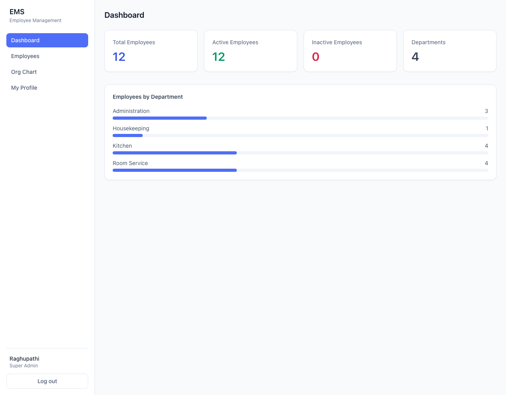
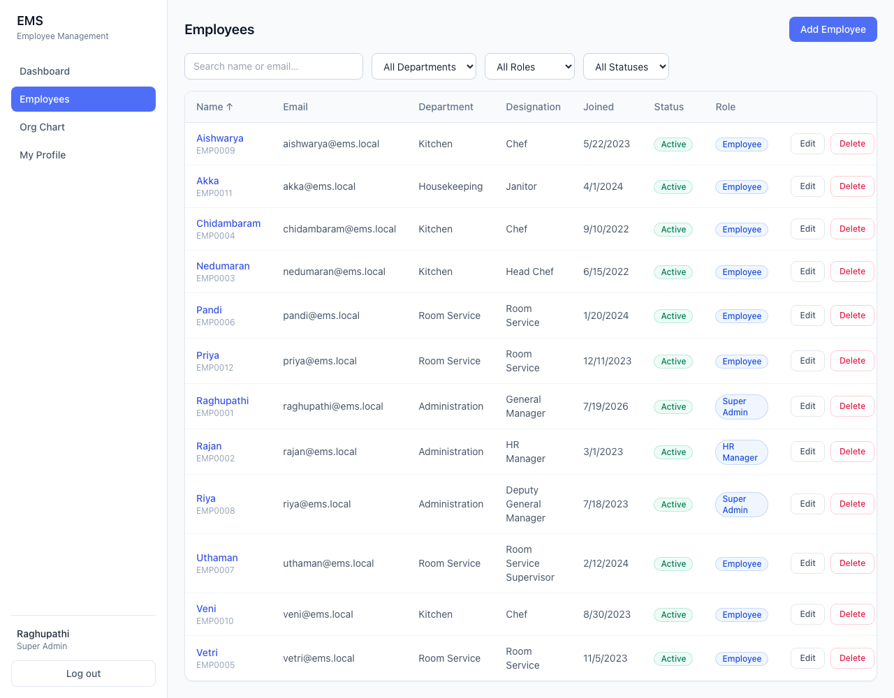
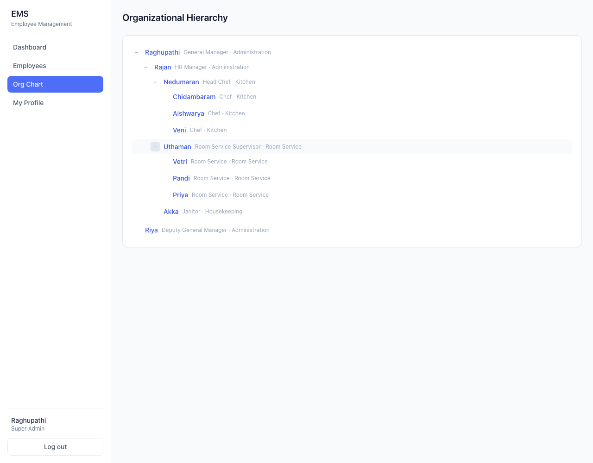
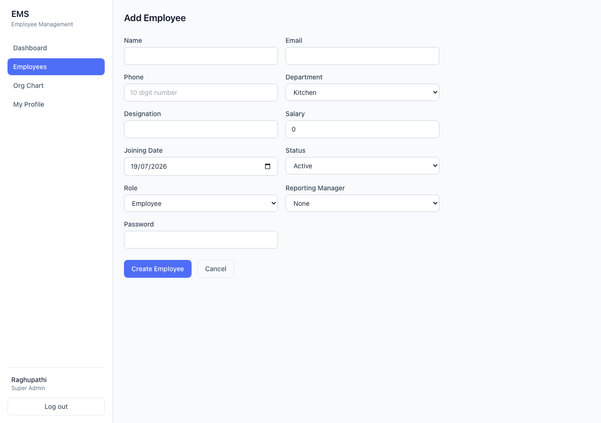
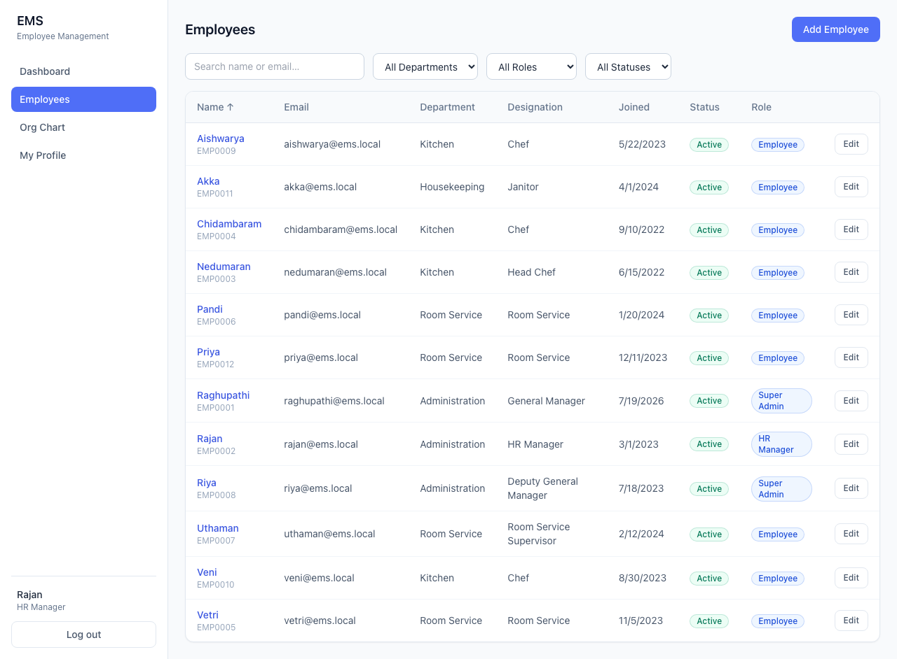
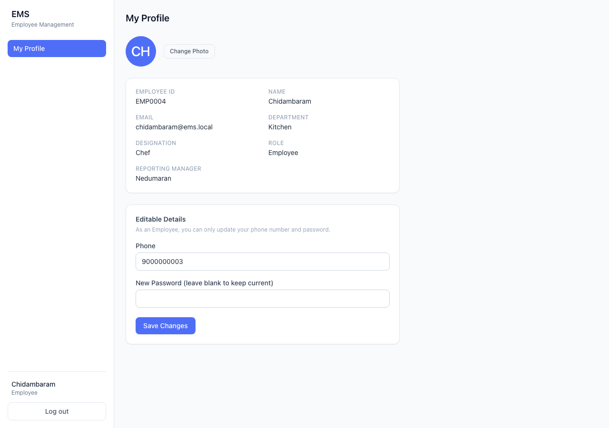
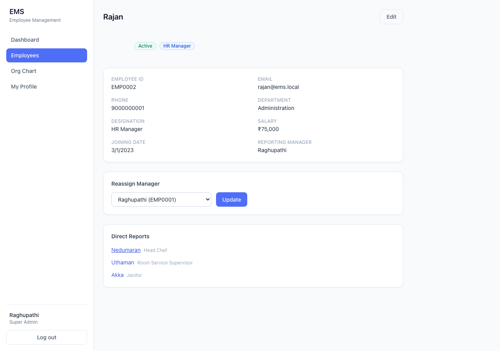
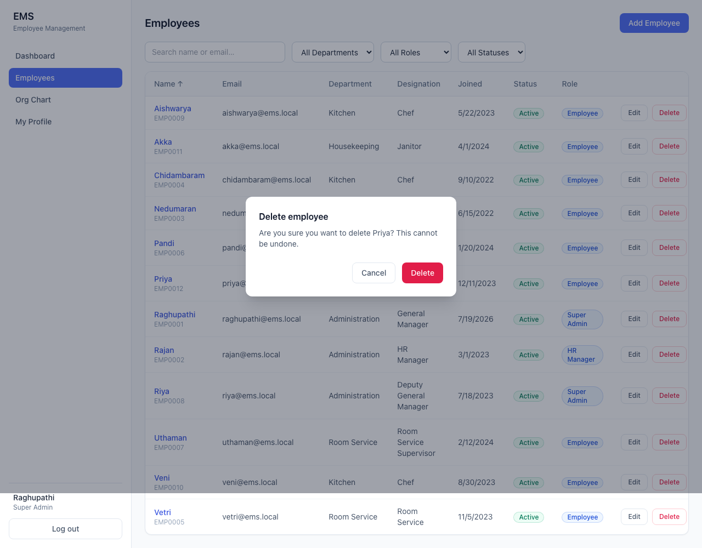

# Employee Management System (EMS)

A full-stack Employee Management System with JWT authentication, role-based access
control (Super Admin / HR Manager / Employee), employee CRUD, organizational hierarchy,
and a stats dashboard.

## Tech Stack

- **Frontend**: React 18 + TypeScript (Vite), Tailwind CSS, React Router, React Hook Form + Zod
- **Backend**: Node.js + Express + TypeScript
- **Database**: MongoDB (Mongoose)
- **Auth**: JWT stored in an httpOnly cookie + bcrypt password hashing

## Project Structure

```
employee-management-system/
├── backend/     Express API (TypeScript)
└── frontend/    React app (Vite + TypeScript + Tailwind)
```

## Prerequisites

- Node.js 18+ (developed against Node 20)
- A MongoDB database — either a local `mongod` instance or a free
  [MongoDB Atlas](https://www.mongodb.com/cloud/atlas/register) cluster

## Setup

### 1. Backend

```bash
cd backend
cp .env.example .env
# edit .env and set MONGODB_URI to your database connection string
npm install
npm run seed   # creates the bootstrap Super Admin account
npm run dev    # starts the API on http://localhost:5000
```

The seed script creates one Super Admin using the credentials in `.env`
(`SEED_ADMIN_EMAIL` / `SEED_ADMIN_PASSWORD`, defaults to
`raghupathi@ems.local` / `Password123`). There is no public self-registration by
design — the Super Admin creates all other accounts (HR Managers and Employees)
from the Employees screen.

### 2. Frontend

```bash
cd frontend
cp .env.example .env   # VITE_API_URL defaults to http://localhost:5000
npm install
npm run dev             # starts the app on http://localhost:5173
```

Open http://localhost:5173 and log in with the seeded Super Admin credentials.

## Demo Data

The database is pre-populated with a small hotel-staff org so the RBAC and hierarchy
features are visible right away. All accounts use the password `Password123`.
Departments are `Kitchen`, `Room Service`, `Housekeeping`, and `Administration`.

| Name | Role | Department | Designation | Reports to |
|---|---|---|---|---|
| Raghupathi | Super Admin | Administration | General Manager | — |
| Riya | Super Admin | Administration | Deputy General Manager | — |
| Rajan | HR Manager | Administration | HR Manager | Raghupathi |
| Nedumaran | Employee | Kitchen | Head Chef | Rajan |
| Uthaman | Employee | Room Service | Room Service Supervisor | Rajan |
| Chidambaram | Employee | Kitchen | Chef | Nedumaran |
| Aishwarya | Employee | Kitchen | Chef | Nedumaran |
| Veni | Employee | Kitchen | Chef | Nedumaran |
| Vetri | Employee | Room Service | Room Service | Uthaman |
| Pandi | Employee | Room Service | Room Service | Uthaman |
| Priya | Employee | Room Service | Room Service | Uthaman |
| Akka | Employee | Housekeeping | Janitor | Rajan |

Emails follow `firstname@ems.local` (e.g. `vetri@ems.local`). Both Raghupathi and Riya
are Super Admins with no manager; everyone else rolls up through Rajan (HR Manager),
with Nedumaran leading the kitchen team and Uthaman leading room service.

## Roles & Permissions

| Action | Super Admin | HR Manager | Employee |
|---|---|---|---|
| View dashboard | ✅ | ✅ | ❌ |
| List / search / filter employees | ✅ | ✅ | ❌ (own profile only) |
| Create employee | ✅ | ✅ | ❌ |
| Edit any employee | ✅ | ✅ (cannot touch Super Admin accounts) | ❌ |
| Assign Super Admin role | ✅ | ❌ | ❌ |
| Delete employee | ✅ | ❌ | ❌ |
| Assign / reassign reporting manager | ✅ | ✅ | ❌ |
| View organization tree | ✅ | ✅ | ❌ |
| Edit own profile (phone, photo, password only) | ✅ | ✅ | ✅ |

All of the above is enforced **server-side** in the controllers/middleware, not just
hidden in the UI — sending a crafted request as a lower-privileged role is rejected
with a 403.

## Key Design Decisions

- **Single collection**: Employees *are* the login entities — there's no separate
  "User" model. This matches the assignment's field list (Role is one of the employee
  fields) and avoids syncing two collections.
- **JWT in an httpOnly cookie** rather than `localStorage`, to reduce XSS exposure.
  CORS is locked to the frontend origin with `credentials: true`.
- **Atomic employee ID generator** (`EMP0001`, `EMP0002`, …) backed by a MongoDB
  counter document, so concurrent creates never collide.
- **Circular-reporting prevention** walks the proposed manager's chain server-side
  before any reassignment is committed (`backend/src/utils/circularCheck.ts`).
- **Soft guardrail on delete**: an employee with existing direct reports cannot be
  deleted until those reports are reassigned, to avoid orphaned hierarchy data.
- Bonus features (pagination, soft delete, dashboard charts, dark mode, Docker, tests,
  deployment) were intentionally left out to keep the ~3 hour build focused on a
  robust, bug-free core rather than a partially-implemented feature set.

## Screenshots

| Dashboard | Employees List | Org Chart |
|---|---|---|
|  |  |  |

| Add Employee | HR Manager view (no Delete) | Employee self-service |
|---|---|---|
|  |  |  |

| Manager profile with direct reports | Delete confirmation |
|---|---|
|  |  |

## API Documentation

See [`docs/API.md`](docs/API.md) for the full endpoint reference with request/response
examples.

## Manual Test Checklist

1. Log in as the seeded Super Admin.
2. Create an HR Manager and a couple of Employees, assigning departments/managers.
3. Log out, log in as the HR Manager — confirm the Delete button and "Super Admin"
   role option are unavailable, and dashboard/employees list still work.
4. Log in as an Employee — confirm only "My Profile" is visible/reachable, and only
   phone/photo/password are editable.
5. On the Org Chart page, confirm the hierarchy renders and that attempting to set an
   employee's manager to one of their own reports is rejected with a clear error.
6. Delete an employee with direct reports as Super Admin — confirm it's blocked until
   reports are reassigned.
